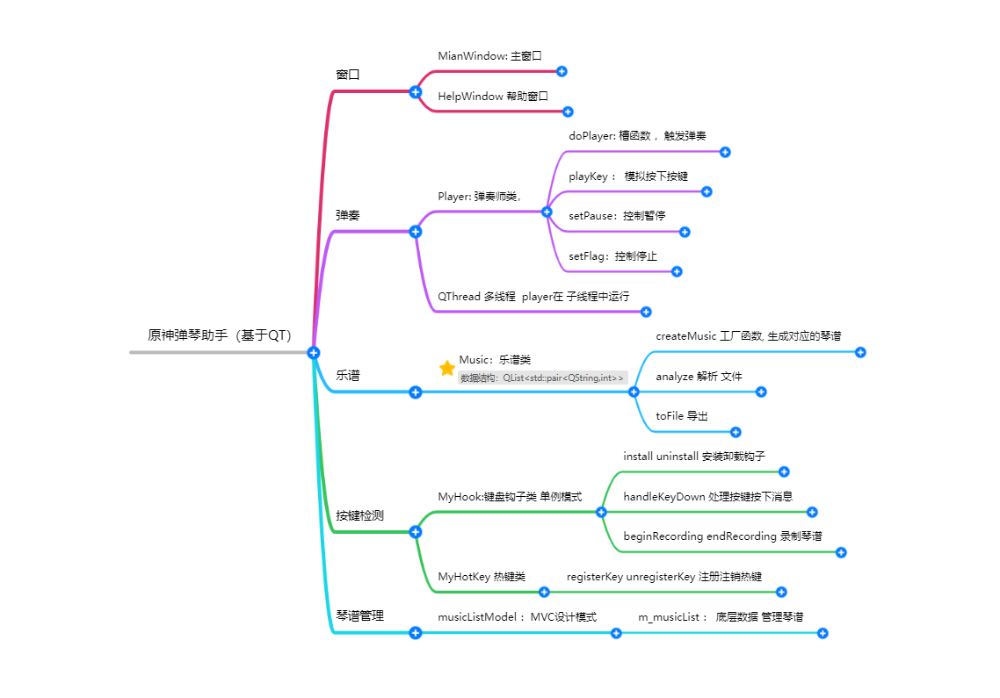

## 作者说明

本程序基于QT6社区版本，IDE为CLion

这是一个练习QT的demo,用于学习交流,希望大家不要嫌弃
曲谱来自：
https://space.bilibili.com/76052941
B站演示视频：https://www.bilibili.com/video/BV1gY411G7rq/

## 下载
阿里云盘：https://www.aliyundrive.com/s/sCLpT1vJi51
PS: 使用Enigma Virtual Box 打包QT 文件稍微有点大，如果不放心 请自行编译
## 示例琴谱文件
```txl
author : 作者名 ,
musicName : 曲名 ,
delay:延时,
sheet :
F6 (FA)6
[200]
FAB
```
完整见 /res/sheet 下

author,musicName,delay 不是必须的,但是sheet是必须的。
PS:
1. 每个属性必须是 `[<属性> : 内容 ,]`  冒号逗号都不可少，且都是半角符号。sheet最后无需跟逗号标记结束
2. delay 是默认延时，也就是一个按键缺省状态下的延时。该属性缺省，则为100ms
3. delay author musicName  都可以缺省，唯独sheet不能缺省。
sheet 说明:
sheet标记琴谱的开始，
1. F6 表示按下 F 键 ，6ms延时
2. (FA)6 表示同时按下 FA 6ms延时
3. [200] 是延时块 代表 后面 FAB 延时 为 200ms (PS:1.5 版本 所有)
4. 基本格式为 `[key] [延时]` ，()抱起来的多个key表示同时按下，`[延时]`可以缺省默认为 delay。
5. 无视空格换行

## 使用 说明
当前最新版本 1.6
PS:本软件已强制使用管理身份运行

### 热键（全局快捷键）

1. 热键负责控制 弹奏暂停、停止弹奏 这两种功能
2. 默认 注册了 F6和 CTRL+F6,分别对应功能：播放暂停、停止弹奏 
3. 如果按键冲突可以自行修改 为F6-F12 ，和 CTRL+F6-F12 。分别对应 这两种不同的功能
4. 进去游戏 按下对应热键， 弹奏琴谱列表中正在被选中的琴谱。

### 弹奏 和 切歌
1. 按下热键弹奏 表格中正在选中的乐谱
2. 修改选中即可完成切换，切换后仍需要 按下热键触发

### 添加管理自定义琴谱
1. 添加 点击 按键或者 对应功能菜单即可
2. 删除 鼠标右键菜单删除即可，无法删除自带的琴谱
### 录入琴谱
1. 点击开始录制之后，在原神中弹奏，弹奏完成 ，再次点击按钮即可
2. 该功能还不完善，略有瑕疵
## 导出琴谱
1. 右键菜单导出、选中路径即可，导出文件名为乐谱名。
2. 界面上有选择框--导出延时信息，选中导出延时，没有选中不导出延时
### 其他
1. 窗口置顶：需要在原神.exe 不再全屏模式 才能霸屏。 PS:原神 ALT+回车 切换全屏和 窗口模式

## 项目简介

### 思路图

 

### 文件结构

```tcl
├─head //头文件
│      helpwindow.h
│      mainwindow.h//主窗口
│      Music.h //乐谱类
│      musicListModel.h// 表格 MVC设计模式设计
│      MyHook.h //钩子
│      Player.h//弹奏线程
│
├─othor
│      app.manifest
│
├─res //资源文件 与之关联的为 qrc文件
│  ├─imgs
│  │      ICO.ico
│  │      miao.png
│  │
│  └─sheet
│          1.txt
│          2.txt
│          3.txt
│
├─src //源码
│      helpwindow.cpp
│      helpwindow.ui
│      main.cpp
│      mainwindow.cpp
│      mainwindow.ui
│      Music.cpp
│      musicListModel.cpp
│      MyHook.cpp
│      Player.cpp
│
├─ui
│      ui_helpwindow.h
│      ui_mainwindow.h
│
└─琴谱
        好运来.txt
        穿越时空的思念.txt
```

mt.exe -manifest "uac.manifest" -outputresource:"原神弹琴助手1.6.exe"

## 更新日志
### 2.0？？
正在开发。。。。
1. 添加琴谱类型
2. 多语言支持

### 1.6
1. 优化了 切换歌曲的操作
### 1.5
1. 优化界面
2. 添加管理自定义琴谱
3. 导出琴谱
4. 录入琴谱
5. 播放和暂停
6. 霸屏
7. 强制管理权限


## 旧版本使用说明

### 1.1
1. 管理员身份启动程序，务必是管理员，否则原神.exe 无法收到按键消息
2. 设置热键(默认设置F6)
3. 选择琴谱(默认选择琴谱1)，也可以载入自定义琴谱
4. 载入琴谱
4. 进入游戏，使用进去弹琴界面
5. 按下热键，开始弹琴，再次按下中断弹奏

PS: 程序启动自动载入了琴谱1，按下热键可以开始弹奏；载入失败，当前琴谱仍为上次载入成功的琴谱


mt.exe -manifest "uac.manifest" -outputresource:"原神弹琴助手.exe.exe"
